<div align="center">

# 🏥 Multi-Med Detect

### AI-Powered Medical Image Diagnostic Assistant

[](https://www.python.org/downloads/)
[](https://www.tensorflow.org/)
[](https://fastapi.tiangolo.com/)
[](https://opensource.org/licenses/MIT)

*Unified medical image diagnostic system with automatic modality detection, specialized deep learning models, and clinical-grade explainability.*

</div>

---

## 📋 Table of Contents

- [Overview](#-overview)
- [Diseases & Classifications](#-diseases--classifications)
- [System Architecture](#-system-architecture)
- [Model Architectures](#-model-architectures)
- [Datasets](#-datasets)
- [Preprocessing Pipelines](#-preprocessing-pipelines)
- [Training Techniques](#-training-techniques)
- [Model Performance](#-model-performance)
- [Grad-CAM Explainability](#-grad-cam-explainability)
- [Tech Stack](#-tech-stack)
- [Installation](#-installation)
- [Usage](#-usage)
- [API Documentation](#-api-documentation)
- [Project Structure](#-project-structure)
- [License](#-license)

---

## 🎯 Overview

**Multi-Med Detect** is a unified medical image diagnostic assistant that can:

- 🔍 **Automatically detect** the type of medical image (Chest X-ray, Brain MRI, Retinal fundus)
- 🧠 **Route to specialized models** trained for each specific condition
- 📊 **Return diagnosis** with confidence scores and probability distributions
- 🔬 **Generate Grad-CAM visualizations** for clinical explainability

### Key Features

| Feature | Description |
|---------|-------------|
| **Multi-Disease Support** | Pneumonia, Brain Tumors, Diabetic Retinopathy |
| **Ensemble Learning** | 3-model ensemble for retinal analysis |
| **Transfer Learning** | Pre-trained ImageNet weights with fine-tuning |
| **Explainability** | Grad-CAM heatmaps for all predictions |
| **Production Ready** | FastAPI backend + Streamlit frontend |
| **Experiment Tracking** | MLflow integration for reproducibility |

---

## 🩺 Diseases & Classifications

### 1. Diabetic Retinopathy (Retinal Fundus Images)

Diabetic Retinopathy (DR) is a diabetes complication affecting the blood vessels of the retina, potentially leading to blindness if untreated.

| Class | Severity Level | Description |
|-------|---------------|-------------|
| 0 | **No DR** | No visible signs of diabetic retinopathy |
| 1 | **Mild** | Microaneurysms only |
| 2 | **Moderate** | More than just microaneurysms but less than severe |
| 3 | **Severe** | Any of the following: >20 intraretinal hemorrhages, venous beading, IRMA |
| 4 | **Proliferative DR** | Neovascularization or vitreous/preretinal hemorrhage |

### 2. Brain Tumor (MRI Images)

Brain tumors are abnormal growths of cells in the brain that can be benign or malignant.

| Class | Tumor Type | Description |
|-------|-----------|-------------|
| 0 | **Glioma** | Tumors arising from glial cells, most common primary brain tumor |
| 1 | **Meningioma** | Tumors arising from meninges, usually benign |
| 2 | **No Tumor** | Normal brain scan with no detectable tumor |
| 3 | **Pituitary** | Tumors of the pituitary gland, often treatable |

### 3. Pneumonia (Chest X-Ray Images)

Pneumonia is a lung infection causing inflammation and fluid buildup in the alveoli.

| Class | Status | Description |
|-------|--------|-------------|
| 0 | **Normal** | Clear lungs with no signs of infection |
| 1 | **Pneumonia** | Visible infiltrates indicating bacterial or viral pneumonia |

---

## 🏗️ System Architecture

```mermaid
flowchart TB
    subgraph Input["📷 Image Input"]
        IMG[Medical Image]
    end
    
    subgraph Meta["🧠 Meta Classifier"]
        DETECT[Auto-Detect Modality]
        ROUTE[Route to Specialized Model]
    end
    
    subgraph Models["🔬 Specialized Models"]
        RETINA["Retina Ensemble<br/>(EfficientNet V2-S/B2/B0)"]
        BRAIN["Brain MRI<br/>(EfficientNetB0)"]
        PNEUMO["Pneumonia<br/>(Xception)"]
    end
    
    subgraph Output["📊 Output"]
        PRED[Prediction + Confidence]
        GRADCAM[Grad-CAM Heatmap]
        PROBS[Class Probabilities]
    end
    
    IMG --> DETECT
    DETECT --> ROUTE
    ROUTE --> RETINA
    ROUTE --> BRAIN
    ROUTE --> PNEUMO
    RETINA --> PRED
    BRAIN --> PRED
    PNEUMO --> PRED
    PRED --> GRADCAM
    PRED --> PROBS
```



### Application Flow


---

## 🧠 Model Architectures

### Retina: EfficientNet Ensemble

The retinal model uses a **weighted ensemble of 3 EfficientNet variants** for robust diabetic retinopathy classification:

```
┌─────────────────────────────────────────────────────────────────┐
│                    RETINA ENSEMBLE                               │
├─────────────────────────────────────────────────────────────────┤
│                                                                  │
│  ┌──────────────────┐  ┌──────────────────┐  ┌──────────────────┐│
│  │ EfficientNetV2-S │  │  EfficientNetB2  │  │  EfficientNetB0  ││
│  │   Weight: 0.333  │  │   Weight: 0.329  │  │   Weight: 0.338  ││
│  │   ~21M params    │  │   ~9M params     │  │   ~5M params     ││
│  └────────┬─────────┘  └────────┬─────────┘  └────────┬─────────┘│
│           │                     │                     │          │
│           └──────────┬──────────┴──────────┬──────────┘          │
│                      ▼                     ▼                     │
│              ┌───────────────────────────────────┐               │
│              │     Weighted Probability Fusion   │               │
│              │   P_ensemble = Σ(wi × Pi) / Σwi   │               │
│              └───────────────────────────────────┘               │
│                              │                                   │
│                              ▼                                   │
│                    ┌─────────────────┐                           │
│                    │  5-Class Output │                           │
│                    │  (Softmax)      │                           │
│                    └─────────────────┘                           │
└─────────────────────────────────────────────────────────────────┘
```

**Architecture Details:**
- **Backbone**: EfficientNet variants pre-trained on ImageNet
- **Custom Head**: Dropout(0.3) → Dense(256, ReLU) → Dropout(0.2) → Dense(5, Softmax)
- **Input Size**: 224×224×3 (RGB)
- **Total Ensemble Parameters**: ~35M

### Brain MRI: EfficientNetB0

```
┌─────────────────────────────────────────────────┐
│              BRAIN MRI MODEL                     │
├─────────────────────────────────────────────────┤
│  Input: 224×224×3                               │
│           │                                      │
│           ▼                                      │
│  ┌─────────────────────┐                        │
│  │  EfficientNetB0     │                        │
│  │  (ImageNet weights) │                        │
│  │  ~5.3M parameters   │                        │
│  └──────────┬──────────┘                        │
│             │                                    │
│             ▼                                    │
│  ┌─────────────────────┐                        │
│  │  Conv2D(32, 3×3)    │                        │
│  │  + ReLU             │                        │
│  └──────────┬──────────┘                        │
│             │                                    │
│             ▼                                    │
│  ┌─────────────────────┐                        │
│  │ GlobalAveragePool2D │                        │
│  └──────────┬──────────┘                        │
│             │                                    │
│             ▼                                    │
│  ┌─────────────────────┐                        │
│  │  Dropout(0.3)       │                        │
│  └──────────┬──────────┘                        │
│             │                                    │
│             ▼                                    │
│  ┌─────────────────────┐                        │
│  │  Dense(4, Softmax)  │                        │
│  └─────────────────────┘                        │
└─────────────────────────────────────────────────┘
```

### Pneumonia: Xception

```
┌─────────────────────────────────────────────────┐
│              PNEUMONIA MODEL                     │
├─────────────────────────────────────────────────┤
│  Input: 256×256×3                               │
│           │                                      │
│           ▼                                      │
│  ┌─────────────────────┐                        │
│  │     Xception        │                        │
│  │  (ImageNet weights) │                        │
│  │  + GlobalAvgPool    │                        │
│  │  ~22.9M parameters  │                        │
│  └──────────┬──────────┘                        │
│             │                                    │
│             ▼                                    │
│  ┌─────────────────────┐                        │
│  │  BatchNormalization │                        │
│  └──────────┬──────────┘                        │
│             │                                    │
│             ▼                                    │
│  ┌─────────────────────┐                        │
│  │  Dropout(0.25)      │                        │
│  └──────────┬──────────┘                        │
│             │                                    │
│             ▼                                    │
│  ┌─────────────────────┐                        │
│  │  Dense(256, ReLU)   │                        │
│  └──────────┬──────────┘                        │
│             │                                    │
│             ▼                                    │
│  ┌─────────────────────┐                        │
│  │  Dropout(0.25)      │                        │
│  └──────────┬──────────┘                        │
│             │                                    │
│             ▼                                    │
│  ┌─────────────────────┐                        │
│  │ Dense(1, Sigmoid)   │  Binary classification │
│  └─────────────────────┘                        │
└─────────────────────────────────────────────────┘
```

---

## 📊 Datasets

### 1. APTOS 2019 Diabetic Retinopathy Dataset

| Attribute | Value |
|-----------|-------|
| **Source** | [Kaggle APTOS 2019](https://www.kaggle.com/c/aptos2019-blindness-detection) |
| **Images** | 3,662 training images |
| **Format** | High-resolution fundus photographs |
| **Classes** | 5 (severity grades 0-4) |
| **Imbalance** | Highly imbalanced (majority No DR) |

**Class Distribution:**
```
Class 0 (No DR):        1805 (49.3%)
Class 1 (Mild):          370 (10.1%)
Class 2 (Moderate):      999 (27.3%)
Class 3 (Severe):        193 (5.3%)
Class 4 (Proliferative): 295 (8.1%)
```

### 2. Brain Tumor MRI Dataset

| Attribute | Value |
|-----------|-------|
| **Source** | [Kaggle Brain MRI Dataset](https://www.kaggle.com/datasets/masoudnickparvar/brain-tumor-mri-dataset) |
| **Training Images** | ~5,712 images |
| **Testing Images** | ~1,311 images |
| **Format** | 2D MRI slices (PNG/JPG) |
| **Classes** | 4 (glioma, meningioma, notumor, pituitary) |

### 3. Chest X-Ray Pneumonia Dataset

| Attribute | Value |
|-----------|-------|
| **Source** | [Kaggle Chest X-Ray Dataset](https://www.kaggle.com/datasets/paultimothymooney/chest-xray-pneumonia) |
| **Training Images** | 5,216 images |
| **Testing Images** | 624 images |
| **Format** | Chest X-ray images (JPEG) |
| **Classes** | 2 (NORMAL, PNEUMONIA) |

---

## 🔧 Preprocessing Pipelines

### Retina Preprocessing (Advanced)

The retina preprocessing pipeline is designed to enhance lesion visibility while preserving subtle features:

```mermaid
flowchart LR
    A[Raw Image] --> B[Crop Black Borders]
    B --> C[Detect Circular Fundus]
    C --> D[Resize with Aspect Ratio]
    D --> E[CLAHE Enhancement]
    E --> F[Normalize to 0-1]
    F --> G[Output: 224×224×3]
```



**Step-by-Step:**

1. **Black Border Cropping**
   - Threshold-based mask creation
   - Morphological closing to fill holes
   - Contour-based bounding box extraction

2. **Circle Detection & Cropping**
   - Gaussian blur for noise reduction
   - Binary thresholding
   - Find largest contour (fundus region)
   - Circular mask and crop

3. **Resize with Aspect Ratio Preservation**
   - Scale to fit target size
   - Pad with black to maintain square aspect
   - Target: 512×512 → 224×224 (resized for model)

4. **CLAHE Enhancement (LAB Color Space)**
   - Convert BGR → LAB
   - Apply CLAHE to L-channel (clip_limit=2.0, tile_grid=(8,8))
   - Convert back to RGB

5. **Normalization**
   - Scale pixel values to [0, 1] range
   - Float32 output

### Brain MRI Preprocessing

```python
# Simple preprocessing for Brain MRI
1. Load image (grayscale or RGB)
2. Resize to 224×224
3. Apply EfficientNet preprocessing (scale to [-1, 1])
4. Expand batch dimension
```

### Pneumonia Preprocessing

```python
# Preprocessing for Chest X-rays
1. Load image
2. Resize to 256×256
3. Apply Xception preprocessing (scale to [-1, 1])
4. Expand batch dimension
```

---

## 🎓 Training Techniques

### Two-Phase Transfer Learning

All models use a two-phase training approach:


### Advanced Training Features

| Technique | Application | Purpose |
|-----------|-------------|---------|
| **Mixup Augmentation** | Retina | Regularization, better generalization |
| **CutMix Augmentation** | Retina | Prevents overfitting on local features |
| **Class Weighting** | All models | Handles class imbalance |
| **Minority Oversampling** | Retina | 2× boost for rare classes |
| **Cosine LR Schedule** | Retina | Smooth learning rate decay |
| **Warmup Epochs** | Retina | Stable initial training |
| **AdamW Optimizer** | Retina | Weight decay regularization |
| **Label Smoothing** | Retina | Prevents overconfident predictions |

### Data Augmentation

```python
# Retina Augmentation (Strong)
augmentation:
  rotation: 0.02
  width_shift: 0.05
  height_shift: 0.05
  zoom: 0.05
  horizontal_flip: True
  mixup_probability: 0.3
  cutmix_probability: 0.3

# Pneumonia Augmentation (Medical-Safe)
augmentation:
  rotation: 0           # No rotation for X-rays
  width_shift: 0.05
  height_shift: 0.05
  zoom: 0.05
  horizontal_flip: False  # Preserve anatomical orientation
```

### Loss Functions

| Model | Loss Function | Details |
|-------|--------------|---------|
| **Retina** | Combined Ordinal + Focal | Ordinal for severity ordering, Focal for class imbalance |
| **Brain MRI** | Categorical Cross-Entropy | Standard multi-class loss |
| **Pneumonia** | Binary Cross-Entropy | Binary classification |

### Callbacks

```python
callbacks = [
    EarlyStopping(
        monitor='val_qwk',      # Quadratic Weighted Kappa for retina
        patience=10,
        restore_best_weights=True
    ),
    ReduceLROnPlateau(
        monitor='val_qwk',
        factor=0.5,
        patience=4
    ),
    ModelCheckpoint(
        save_best_only=True,
        monitor='val_qwk'
    )
]
```

---

## 📈 Model Performance

### Retina Ensemble Performance

The EfficientNet ensemble achieved strong results on diabetic retinopathy classification:

| Metric | Value |
|--------|-------|
| **Quadratic Weighted Kappa (QWK)** | 0.85+ |
| **AUC-ROC (Macro)** | 0.92+ |
| **Overall Accuracy** | 82%+ |

**Per-Class Performance:**

| Class | Precision | Recall | F1-Score |
|-------|-----------|--------|----------|
| No DR | 0.89 | 0.91 | 0.90 |
| Mild | 0.62 | 0.48 | 0.54 |
| Moderate | 0.78 | 0.82 | 0.80 |
| Severe | 0.58 | 0.52 | 0.55 |
| Proliferative | 0.81 | 0.79 | 0.80 |

> **Note**: Mild and Severe classes have lower performance due to class imbalance and subtle visual differences.

### Training History Visualization

The training process generates comprehensive visualizations:

**Training Metrics Over Epochs:**
- Loss curves (train/validation)
- Accuracy progression
- QWK evolution
- Learning rate schedule

**Model Comparison:**
- Individual model performance
- Ensemble vs single model gains

**Confusion Matrix:**
- Per-class predictions
- Error analysis

### Brain MRI Performance

| Metric | Value |
|--------|-------|
| **Test Accuracy** | 95%+ |
| **Validation Accuracy** | 94%+ |

### Pneumonia Performance

| Metric | Value |
|--------|-------|
| **Test Accuracy** | 92%+ |
| **Validation Accuracy** | 93%+ |

---

## 🔬 Grad-CAM Explainability

### What is Grad-CAM?

**Gradient-weighted Class Activation Mapping (Grad-CAM)** produces visual explanations for CNN decisions by highlighting the important regions in the input image.


### Implementation

Each disease model has a dedicated Grad-CAM generator:

- `BrainMRIGradCAM` - Highlights tumor regions
- `PneumoniaGradCAM` - Shows lung infiltrate areas
- `RetinaGradCAM` - Identifies lesion locations (hemorrhages, exudates)

### Example Output

```
┌─────────────────────────────────────────────────┐
│  Original Image  │       Grad-CAM Overlay       │
├─────────────────────────────────────────────────┤
│  [Fundus Photo]  │  [Heatmap highlighting       │
│                  │   detected lesions in        │
│                  │   red/yellow regions]        │
└─────────────────────────────────────────────────┘
```

### Clinical Interpretation

The Grad-CAM visualizations include:
- **Heatmap overlay** with transparency control
- **Region marking** with dotted lines for clinical readability
- **Confidence scores** aligned with highlighted regions

---

## 🛠️ Tech Stack

### Core Framework

| Component | Technology | Version |
|-----------|------------|---------|
| **Deep Learning** | TensorFlow/Keras | 2.15+ |
| **Backend API** | FastAPI | 0.100+ |
| **Frontend** | Streamlit | 1.28+ |
| **Image Processing** | OpenCV | 4.8+ |

### ML/Data Tools

| Tool | Purpose |
|------|---------|
| **NumPy** | Numerical operations |
| **Pandas** | Data manipulation |
| **scikit-learn** | Metrics, preprocessing |
| **Matplotlib/Seaborn** | Visualization |

### MLOps

| Tool | Purpose |
|------|---------|
| **MLflow** | Experiment tracking |
| **DVC** | Data version control |
| **Docker** | Containerization |

### Infrastructure

| Component | Description |
|-----------|-------------|
| **GPU** | NVIDIA RTX 4060 8GB (training) |
| **Python** | 3.10+ |

---

## 📥 Installation

### Prerequisites

- Python 3.10+
- NVIDIA GPU with CUDA support (recommended for training)
- Git

### Setup

1. **Clone the repository**
```bash
git clone https://github.com/MayurBhama/Multi-Disease-Detection.git
cd Multi-Disease-Detection
```

2. **Create virtual environment**
```bash
python -m venv venv
source venv/bin/activate  # Linux/Mac
# OR
venv\Scripts\activate     # Windows
```

3. **Install dependencies**
```bash
# Core requirements
pip install -r requirements.txt

# API-specific
pip install -r requirements-api.txt

# Frontend-specific
pip install -r requirements-frontend.txt
```

4. **Download model weights**
```bash
# Using DVC (recommended)
dvc pull

# Or manually place weights in models/ directory
```

---

## 🚀 Usage

### Running the API Server

```bash
uvicorn src.api.main:app --reload --port 8001
```

Access the API at: `http://localhost:8001`

API Documentation: `http://localhost:8001/docs`

### Running the Streamlit Frontend

```bash
streamlit run web/app.py
```

Access the app at: `http://localhost:8501`

### Making Predictions (Python)

```python
from src.meta_classifier import MetaClassifier

# Initialize classifier
classifier = MetaClassifier()

# Brain MRI prediction
result = classifier.predict("path/to/mri.png", disease_type="brain_mri")
print(f"Prediction: {result['predicted_class']}")
print(f"Confidence: {result['confidence']:.2%}")

# Pneumonia prediction
result = classifier.predict("path/to/xray.png", disease_type="pneumonia")

# Retina prediction (ensemble)
result = classifier.predict("path/to/fundus.png", disease_type="retina")

# With Grad-CAM explanation
result = classifier.explain("path/to/image.png", disease_type="retina")
```

---

## 📡 API Documentation

### Endpoints

| Method | Endpoint | Description |
|--------|----------|-------------|
| `GET` | `/` | Health check |
| `GET` | `/health` | Detailed health status |
| `POST` | `/predict` | Make prediction |
| `POST` | `/explain` | Prediction + Grad-CAM |

### Prediction Request

```bash
curl -X POST "http://localhost:8001/predict" \
  -H "Content-Type: multipart/form-data" \
  -F "file=@image.png" \
  -F "disease_type=retina"
```

### Response Schema

```json
{
  "disease_type": "retina",
  "predicted_class": "Moderate",
  "class_id": 2,
  "confidence": 0.856,
  "probabilities": {
    "No DR": 0.05,
    "Mild": 0.08,
    "Moderate": 0.856,
    "Severe": 0.01,
    "Proliferative": 0.004
  },
  "model_info": {
    "architecture": "EfficientNet Ensemble",
    "num_classes": 5,
    "ensemble_models": ["EfficientNetV2-S", "EfficientNetB2", "EfficientNetB0"]
  },
  "timestamp": "2024-12-13T12:00:00"
}
```

---

## 📁 Project Structure

```
Multi-Disease-Detection/
├── configs/                    # Model configurations
│   ├── brain_mri.yaml
│   ├── pneumonia.yaml
│   ├── retina_densenet.yaml
│   └── retina_efficientnetv2.yaml
├── data/                       # Data directory (DVC tracked)
│   ├── raw/                    # Raw datasets
│   ├── processed/              # Preprocessed data
│   └── meta/                   # Metadata files
├── models/                     # Trained model weights
│   ├── brain_mri/
│   ├── pneumonia/
│   └── retina/
├── outputs/                    # Training outputs
│   ├── production/             # Production model artifacts
│   │   ├── graphs/             # Training visualizations
│   │   └── models/             # Best model weights
│   └── gradcam/                # Grad-CAM outputs
├── src/                        # Source code
│   ├── api/                    # FastAPI backend
│   │   ├── main.py
│   │   ├── router_predict.py
│   │   └── router_gradcam.py
│   ├── data_loader/            # Data loading utilities
│   ├── meta_classifier/        # Core prediction engine
│   │   ├── predictor.py        # MetaClassifier
│   │   ├── loader.py           # Model loading
│   │   ├── retina_ensemble.py  # Ensemble logic
│   │   └── inference/          # Grad-CAM generators
│   ├── preprocessing/          # Image preprocessing
│   ├── training/               # Training scripts
│   └── utils/                  # Logger, exceptions
├── web/                        # Streamlit frontend
│   ├── app.py
│   ├── api_client.py
│   └── styles.py
├── scripts/                    # Utility scripts
├── tests/                      # Test suite
├── requirements.txt            # Core dependencies
├── requirements-api.txt        # API dependencies
├── requirements-frontend.txt   # Frontend dependencies
├── Dockerfile                  # Container definition
└── README.md                   # This file
```

---

## 📄 License

This project is licensed under the MIT License - see the [LICENSE](LICENSE) file for details.

---

## 🙏 Acknowledgments

- **APTOS 2019** for the Diabetic Retinopathy dataset
- **Kaggle** for hosting the datasets
- **TensorFlow/Keras** team for the deep learning framework
- **EfficientNet** authors for the model architectures

---

<div align="center">

**!! OM NAMAH SHIVAY !!**

Made with ❤️ for Medical AI

</div>